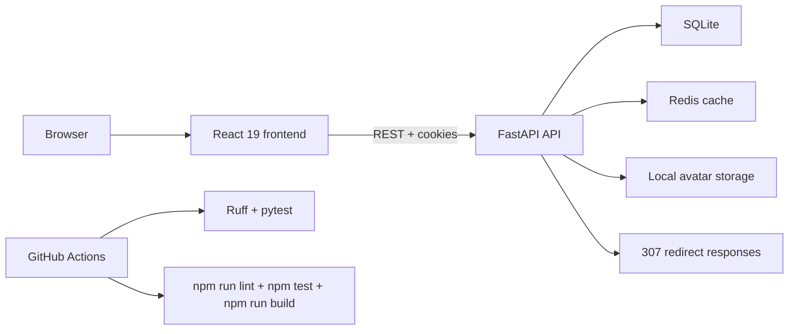

<div align="center">
  <h1>LinkCutter</h1>
  <p><strong>FastAPI and React link shortener with guest links, account workspaces, analytics, and admin moderation.</strong></p>
  <p><strong>Сервис коротких ссылок на FastAPI и React с гостевым режимом, личным кабинетом, аналитикой и админ-модерацией.</strong></p>
  <p>
    <a href="./README.md"><strong>English</strong></a>
    ·
    <a href="./README.ru.md">Русский</a>
  </p>
  <p>
    <a href="#quick-start">Quick start</a>
    ·
    <a href="#architecture">Architecture</a>
    ·
    <a href="#api-scope">API scope</a>
    ·
    <a href="./CONTRIBUTING.md">Contributing</a>
    ·
    <a href="./SECURITY.md">Security</a>
    ·
    <a href="./CHANGELOG.md">Changelog</a>
  </p>
  <p>
    
    
    
    
    
    
  </p>
</div>

LinkCutter combines two working surfaces in one repository:

- a FastAPI backend for guest short links, auth, personal workspaces, analytics, and admin actions
- a React 19 frontend for guests and signed-in users

This repository does not document a public demo. Run it locally.

## Screenshots

### Account workspace

| Links | Analytics | Folders |
| --- | --- | --- |
|  |  |  |

| Notifications | Settings | Profile |
| --- | --- | --- |
|  |  |  |

## Project Snapshot

| Area | Stack | Verified scope |
| --- | --- | --- |
| Backend | FastAPI, Pydantic v2, Uvicorn | Guest and account link creation, redirects, auth, admin API |
| Frontend | React 19, TypeScript, Vite, Tailwind | Guest creation, links, folders, analytics, notifications, profile, settings |
| Storage | SQLite | Source of truth for users, links, sessions, notifications, analytics |
| Cache | Redis 7 | Optional redirect cache with degraded readiness when unavailable |
| Auth | Argon2, JWT access tokens, rotating refresh cookies | Register, verify email, login, logout, password reset, email 2FA |
| QA | Ruff, pytest, Vitest, Playwright, GitHub Actions | Backend lint and tests, frontend lint, unit and browser checks |

## Quick Start

### Docker Compose

Use this path if you want the frontend, API, SQLite, and Redis wired together.

```bash
cp .env.example .env
docker compose up --build
```

Open these local URLs after the stack starts:

- App: `http://127.0.0.1:3000`
- Swagger UI: `http://127.0.0.1:8000/docs`
- OpenAPI: `http://127.0.0.1:8000/openapi.json`

Compose serves the frontend through Nginx. Nginx proxies `/api`, `/health`, and shortcode redirects to FastAPI.

### Local Development

Run the backend:

```bash
python3 -m venv .venv
source .venv/bin/activate
pip install -r requirements-dev.txt
cp .env.example .env
uvicorn main:app --app-dir src --reload
```

Run the frontend in a second terminal:

```bash
cd frontend
npm ci
npm run dev
```

Local defaults:

- Vite serves the frontend on `http://127.0.0.1:3000`
- Vite proxies `/api` and `/health` to `http://127.0.0.1:8000`
- direct backend runs use `PUBLIC_BASE_URL=http://localhost:8000` unless you override it

If you want the first registered user to become an admin, set `ADMIN_EMAILS` in `.env` before that account signs up.

## Architecture



Key behavior:

- SQLite stays the source of truth.
- Redis caches shortcodes and can drop out without stopping the app.
- FastAPI issues JWT access tokens and rotating refresh cookies.
- The frontend uses relative API paths. Vite proxies them in local development and Nginx proxies them in Compose.

### Optional Demo Data

The local-only seed creates verified demo admin and user accounts, folders, active and disabled links, notifications, and aggregate click data. It refuses production mode and requires an explicit password.

```bash
DEMO_SEED_PASSWORD='DemoPass123!' PYTHONPATH=src python -m app.demo_seed
```

Use `demo-admin@example.com` or `demo-user@example.com` with the password you supplied. Do not run this command against data you want to keep.

## API Scope

| Surface | Paths | What it covers |
| --- | --- | --- |
| Public links | `POST /api/v1/links`, `GET /{shortcode}` | Guest link creation, owner link creation, 307 redirects, click counting |
| Auth | `/api/v1/auth/*`, `GET /api/v1/me` | Register, verify email, login, refresh, logout, password reset, 2FA login challenge |
| Personal workspace | `/api/v1/me/links*`, `/api/v1/me/folders*` | Link lists, search, sorting, labels, folders, active state |
| Analytics | `/api/v1/me/analytics`, `/api/v1/me/links/{shortcode}/analytics` | Summary metrics, time buckets, top links, timezone-aware queries |
| Profile and account | `/api/v1/me/profile`, `/api/v1/me/avatar`, `/api/v1/me/preferences`, `/api/v1/me/export`, `DELETE /api/v1/me` | Profile edits, avatar upload, theme and language settings, JSON export, account deletion |
| Notifications | `/api/v1/me/notifications*` | List, mark one read, mark all read |
| Admin | `/api/v1/admin/users*`, `/api/v1/admin/links*`, `/api/v1/admin/settings*` | User moderation, link moderation, link-retention settings |
| Health | `/health/live`, `/health/ready` | Process status, SQLite check, Redis status |

Backend rules worth knowing:

- Guest duplicates reuse one shortcode and return `200` with `created: false`.
- Bare domains normalize to `https://...`.
- The API rejects credentials in URLs and non-global targets such as `localhost` and private IP ranges.
- Owners and admins can change labels and active state. They cannot change the target URL or shortcode.

## Testing

The CI workflow on `main` runs these checks:

```bash
ruff check .
pytest --cov=src --cov-report=term-missing --cov-report=xml
cd frontend && npm run lint
cd frontend && npm test
cd frontend && npm run build
cd frontend && npm run test:e2e
```

## Repository Layout

| Path | Purpose |
| --- | --- |
| `src/` | FastAPI app, services, schemas, persistence, Redis cache |
| `frontend/` | React app, API client, pages, frontend tests |
| `tests/` | Backend test suite |
| `scripts/` | Local helper scripts |
| `docker-compose.yml` | Local multi-service stack |

## Limitations

- The repo does not expose a verified public demo.
- Email verification, password reset, and email 2FA return debug tokens or codes in development. Production needs a configured email provider.
- SQLite is the only persistent database in the repo. No migration layer or alternate production database is present.
- Redis improves redirect speed, but the app must tolerate cache misses and degraded readiness.
- Rate limiting uses Redis when available and an in-memory fallback locally. It is not a distributed production limiter.
- Local avatar storage, SQLite, and development email tokens are deliberate pet-project boundaries.

## Supporting Docs

- [CONTRIBUTING.md](./CONTRIBUTING.md)
- [SECURITY.md](./SECURITY.md)
- [CHANGELOG.md](./CHANGELOG.md)
- [docs/readme-assets/logo.svg](./docs/readme-assets/logo.svg)

## License

This project uses the [MIT License](./LICENSE).
