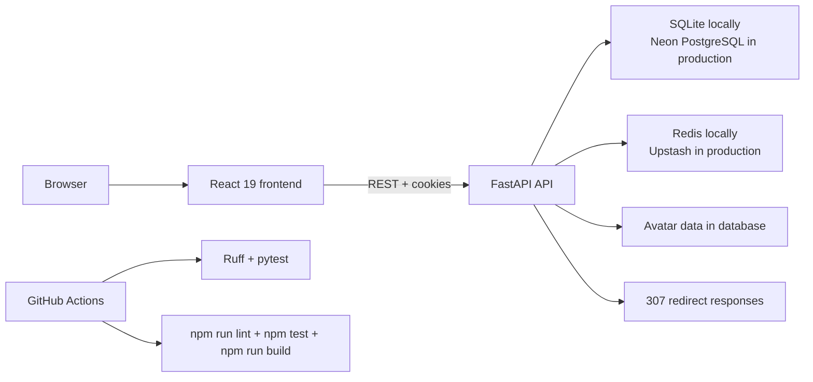

<div align="center">
  
  <h1>LinkCutter</h1>
  <p><strong>FastAPI and React link shortener with guest links, account workspaces, analytics, and admin moderation.</strong></p>
  <p><strong>Сервис коротких ссылок на FastAPI и React с гостевым режимом, личным кабинетом, аналитикой и админ-модерацией.</strong></p>
  <p>
    <a href="./README.md"><strong>English</strong></a>
    ·
    <a href="./README.ru.md">Русский</a>
  </p>
  <p>
    <a href="https://url-shortener-wheat-three.vercel.app">Live demo</a>
    ·
    <a href="https://url-shortener-api-three.vercel.app/docs">API docs</a>
    ·
    <a href="#quick-start">Quick start</a>
    ·
    <a href="#architecture">Architecture</a>
    ·
    <a href="#api-scope">API scope</a>
    ·
    <a href="./CONTRIBUTING.md">Contributing</a>
    ·
    <a href="./SECURITY.md">Security</a>
    ·
    <a href="./CHANGELOG.md">Changelog</a>
  </p>
  <p>
    
    
    
    
    
    
  </p>
</div>

LinkCutter combines two working surfaces in one repository:

- a FastAPI backend for guest short links, auth, personal workspaces, analytics, and admin actions
- a React 19 frontend for guests and signed-in users

Try the [live demo](https://url-shortener-wheat-three.vercel.app) or open the [Swagger UI](https://url-shortener-api-three.vercel.app/docs). The hosted frontend uses the deployed FastAPI backend, Neon PostgreSQL, and Upstash Redis.

## Why LinkCutter

- Guest users shorten a URL without registration.
- Registered users get a private workspace with labels, folders, click counts, and basic analytics.
- Owners and staff cannot change a link's target URL or shortcode after creation.
- Staff roles cover moderation, reports, audit history, retention settings, and account anonymization.
- Email verification and email-based 2FA are available through the API but optional for this pet project.

## Live Demo

- Frontend: [url-shortener-wheat-three.vercel.app](https://url-shortener-wheat-three.vercel.app)
- Backend health: [health/ready](https://url-shortener-api-three.vercel.app/health/ready)
- Swagger UI: [url-shortener-api-three.vercel.app/docs](https://url-shortener-api-three.vercel.app/docs)

## Screenshots

<p align="center">
  
</p>

### Account workspace

| Links | Analytics | Folders |
| --- | --- | --- |
|  |  |  |

| Notifications | Settings | Profile |
| --- | --- | --- |
|  |  |  |

## Project Snapshot

| Area | Stack | Verified scope |
| --- | --- | --- |
| Backend | FastAPI, Pydantic v2, Uvicorn | Guest and account link creation, redirects, auth, admin API |
| Frontend | React 19, TypeScript, Vite, Tailwind | Guest creation, links, folders, analytics, notifications, profile, settings |
| Storage | SQLite locally, Neon PostgreSQL in production | Users, links, sessions, notifications, analytics, and avatar data |
| Cache | Redis 7 locally, Upstash Redis in production | Redirect cache and distributed rate limits |
| Auth | Argon2, JWT access tokens, rotating refresh cookies | Register, verify email, login, logout, password reset, email 2FA |
| QA | Ruff, pytest, Vitest, Playwright, GitHub Actions | Backend lint and tests, frontend lint, unit and browser checks |

## Capability Matrix

| Capability | Minimal shortener | LinkCutter | Full SaaS shortener |
| --- | --- | --- | --- |
| Guest shortening | Usually yes | Yes | Usually yes |
| Private user workspace | Rare | Yes | Yes |
| Immutable target URL | Often unclear | Yes | Varies |
| Owner analytics | Rare | Basic built-in | Advanced |
| Moderation and reports | Rare | Admin API | Usually built-in |
| Local-first development | Sometimes | Docker Compose, SQLite, Redis | Varies |

## Quick Start

### Docker Compose

Use this path if you want the frontend, API, SQLite, and Redis wired together.

```bash
cp .env.example .env
docker compose up --build
```

Open these local URLs after the stack starts:

- App: `http://127.0.0.1:3000`
- Swagger UI: `http://127.0.0.1:8000/docs`
- OpenAPI: `http://127.0.0.1:8000/openapi.json`

Compose serves the frontend through Nginx. Nginx proxies `/api`, `/health`, and shortcode redirects to FastAPI.

### First success

1. Open `http://127.0.0.1:3000`.
2. Paste `https://example.com` into the URL field.
3. Create the short link and open it in a new tab.
4. Open Swagger at `http://127.0.0.1:8000/docs`.

### Local Development

Run the backend:

```bash
python3 -m venv .venv
source .venv/bin/activate
pip install -r requirements-dev.txt
cp .env.example .env
uvicorn main:app --app-dir src --reload
```

Run the frontend in a second terminal:

```bash
cd frontend
npm ci
npm run dev
```

Local defaults:

- Vite serves the frontend on `http://127.0.0.1:3000`
- Vite proxies `/api` and `/health` to `http://127.0.0.1:8000`
- direct backend runs use `PUBLIC_BASE_URL=http://localhost:8000` unless you override it

If you want the first registered user to become an admin, set `ADMIN_EMAILS` in `.env` before that account signs up.

## Architecture



Key behavior:

- SQLite stays the local source of truth. `DATABASE_URL` switches production to Neon PostgreSQL.
- Redis caches shortcodes and provides rate limits. The hosted deployment uses Upstash Redis.
- FastAPI issues JWT access tokens and rotating refresh cookies.
- The frontend uses relative API paths. Vite proxies them in local development and Nginx proxies them in Compose.

### Optional Demo Data

The local-only seed creates verified demo admin and user accounts, folders, active and disabled links, notifications, and aggregate click data. It refuses production mode and requires an explicit password.

```bash
DEMO_SEED_PASSWORD='DemoPass123!' PYTHONPATH=src python -m app.demo_seed
```

Use `demo-admin@example.com` or `demo-user@example.com` with the password you supplied. Do not run this command against data you want to keep.

## API Scope

| Surface | Paths | What it covers |
| --- | --- | --- |
| Public links | `POST /api/v1/links`, `GET /{shortcode}` | Guest link creation, owner link creation, 307 redirects, click counting |
| Auth | `/api/v1/auth/*`, `GET /api/v1/me` | Register, verify email, login, refresh, logout, password reset, 2FA login challenge |
| Personal workspace | `/api/v1/me/links*`, `/api/v1/me/folders*` | Link lists, search, sorting, labels, folders, active state |
| Analytics | `/api/v1/me/analytics`, `/api/v1/me/links/{shortcode}/analytics` | Summary metrics, time buckets, top links, timezone-aware queries |
| Profile and account | `/api/v1/me/profile`, `/api/v1/me/avatar`, `/api/v1/me/preferences`, `/api/v1/me/export`, `/api/v1/me/deletion/request` | Profile edits, optional email verification and email 2FA, JSON export, 30-day deletion cancellation window |
| Notifications | `/api/v1/me/notifications*` | List, mark one read, mark all read |
| Admin | `/api/v1/admin/dashboard`, `/api/v1/admin/users*`, `/api/v1/admin/links*`, `/api/v1/admin/reports*`, `/api/v1/admin/audit-log`, `/api/v1/admin/settings/retention` | RBAC, moderation, reports, audit trail, and retention settings |
| Health | `/health/live`, `/health/ready` | Process status, database check, Redis status |

Backend rules worth knowing:

- Guest duplicates reuse one shortcode and return `200` with `created: false`.
- Bare domains normalize to `https://...`.
- The API rejects credentials in URLs and non-global targets such as `localhost` and private IP ranges.
- Owners and admins can change labels and active state. They cannot change the target URL or shortcode.
- Email verification and email-based 2FA are available but disabled by default for local development.
- `support` can read users and audit records; `moderator` manages reports and link moderation; `admin` manages roles, retention, and account anonymization. Dangerous staff actions require the actor's password.

### Redirect Load Scenario

Install development dependencies, create a known shortcode such as `demo0001`, then run the scenario outside CI:

```bash
locust -f tests/load/locustfile.py --host=http://127.0.0.1:8000
```

## Testing

The CI workflow on `main` runs these checks:

```bash
ruff check .
pytest --cov=src --cov-report=term-missing --cov-report=xml
cd frontend && npm run lint
cd frontend && npm test
cd frontend && npm run build
cd frontend && npm run test:e2e
```

## Repository Layout

| Path | Purpose |
| --- | --- |
| `src/` | FastAPI app, services, schemas, persistence, Redis cache |
| `frontend/` | React app, API client, pages, frontend tests |
| `tests/` | Backend test suite |
| `scripts/` | Local helper scripts |
| `docker-compose.yml` | Local multi-service stack |

## Production Status

| Area | Status |
| --- | --- |
| Guest shortening and redirects | Deployed |
| Account workspace and analytics | Deployed |
| Admin moderation API | Deployed |
| Frontend hosting | Vercel |
| Production database | Vercel Marketplace Neon PostgreSQL |
| Production cache and rate limits | Vercel Marketplace Upstash Redis |
| Email provider | Optional; not required by default |
| Database migrations | Schema bootstrap exists; Alembic remains future work |

Email verification, password reset, and email 2FA need an email provider when you enable them in production.

## Supporting Docs

- [CONTRIBUTING.md](./CONTRIBUTING.md)
- [SECURITY.md](./SECURITY.md)
- [CHANGELOG.md](./CHANGELOG.md)
- [docs/readme-assets/logo.svg](./docs/readme-assets/logo.svg)

## License

This project uses the [MIT License](./LICENSE).
