<div align="center">
  
  <h1>LinkCutter</h1>
  <p><strong>Сервис коротких ссылок с гостевым режимом, личным кабинетом, аналитикой и админ-разделом.</strong></p>
  <p>
    <a href="./README.md">English</a>
    ·
    <a href="./README.ru.md"><strong>Русский</strong></a>
  </p>
  <p>
    <a href="#быстрый-старт">Быстрый старт</a>
    ·
    <a href="#возможности">Возможности</a>
    ·
    <a href="#проверка">Проверка</a>
    ·
    <a href="./CONTRIBUTING.md">Участие</a>
    ·
    <a href="./SECURITY.md">Безопасность</a>
  </p>
</div>

LinkCutter состоит из FastAPI API и React-приложения. Гости сокращают ссылки без регистрации. Пользователи получают папки, статистику, настройки и уведомления. Администратор управляет пользователями, ссылками и сроком жизни ссылок удалённых аккаунтов.

## Скриншоты

### Главная и вход

| Главная, светлая тема | Главная, тёмная тема |
| --- | --- |
| 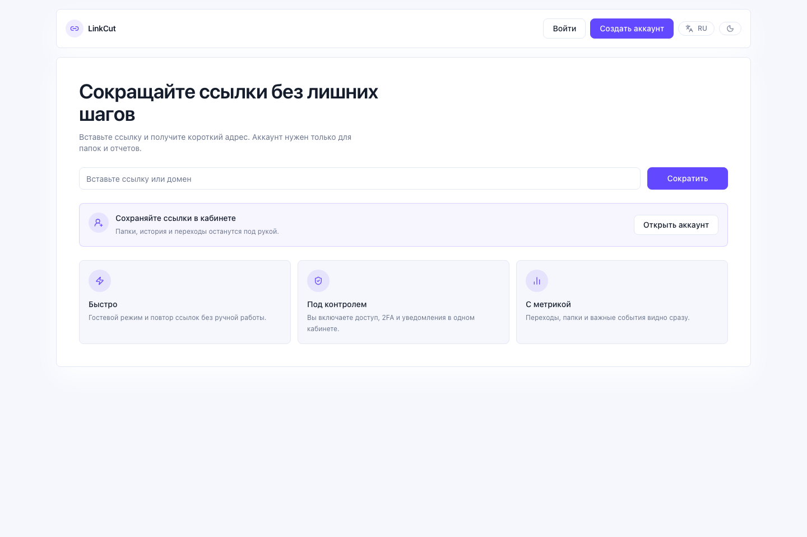 | 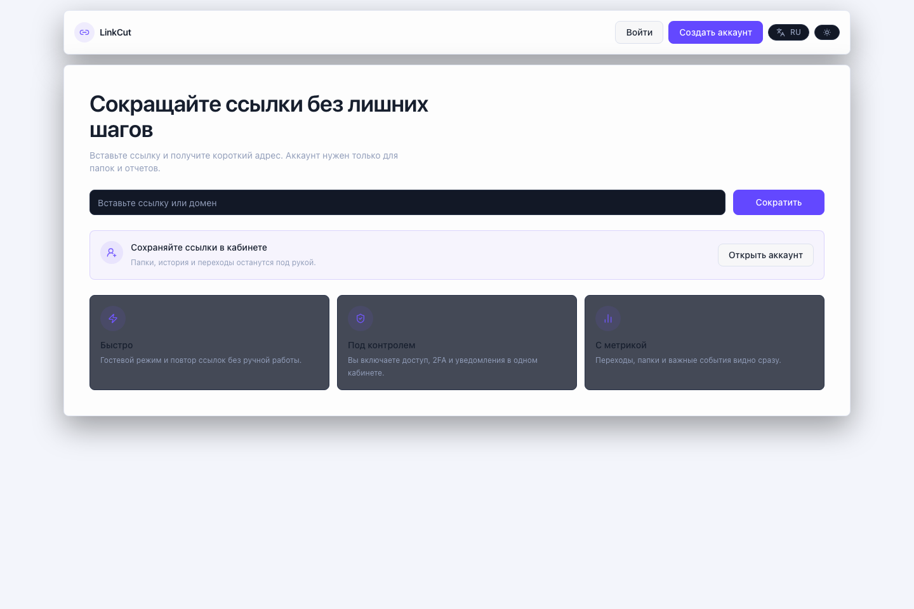 |

| Вход | Регистрация | Подтверждение email |
| --- | --- | --- |
| 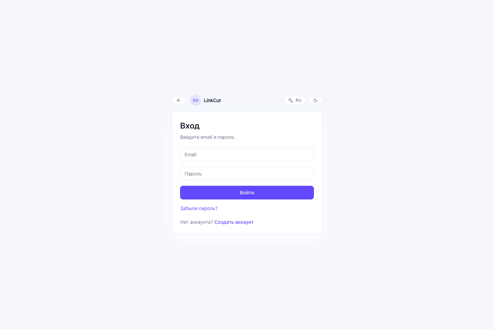 | 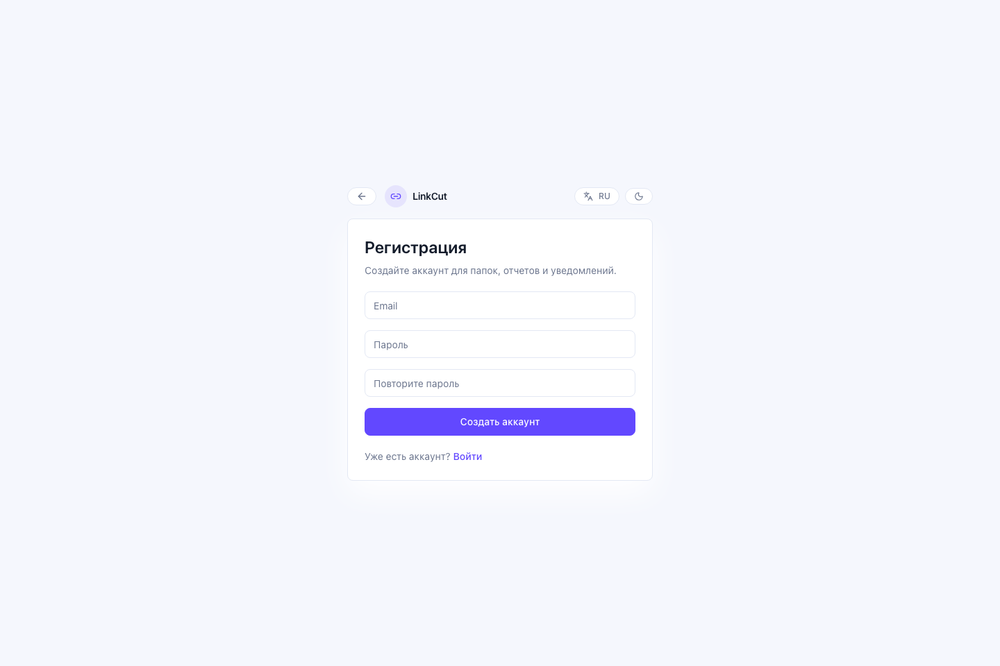 | 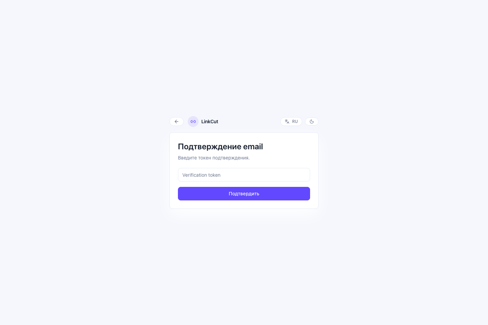 |

| Запрос сброса пароля | Новый пароль |
| --- | --- |
| 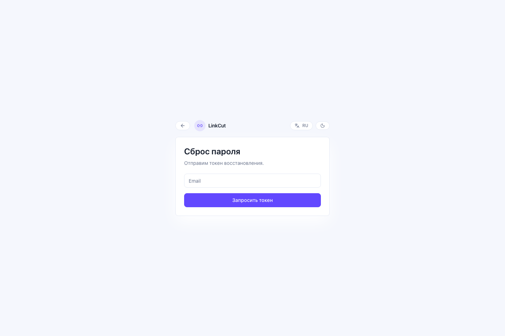 | 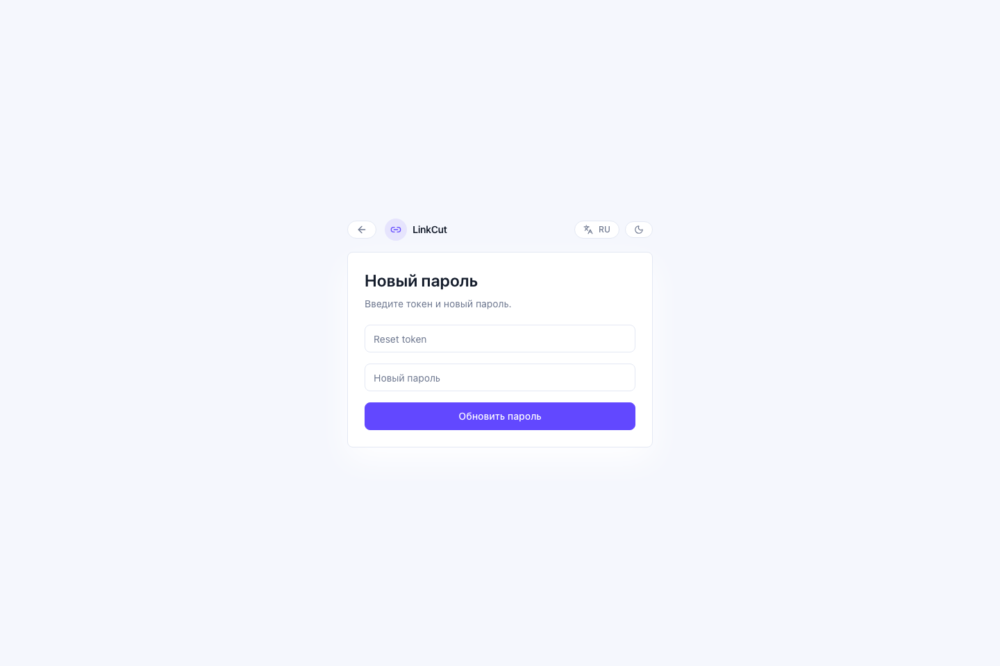 |

### Кабинет и администрирование

| Мои ссылки | Аналитика | Папки |
| --- | --- | --- |
| 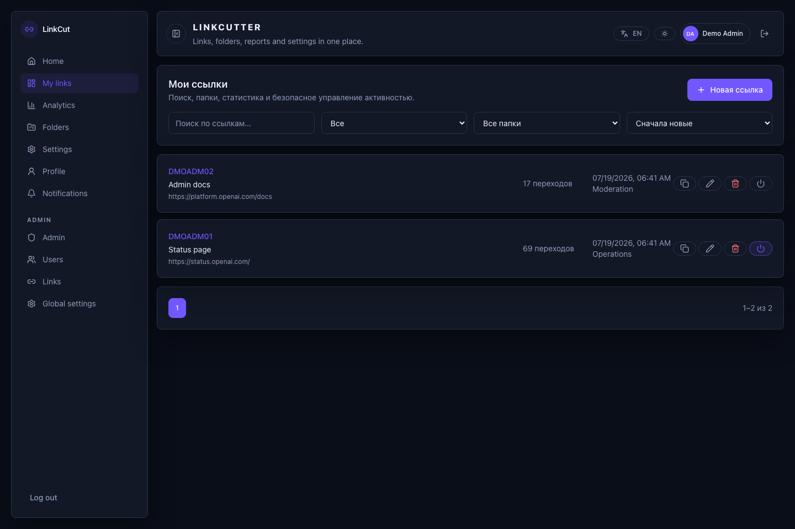 | 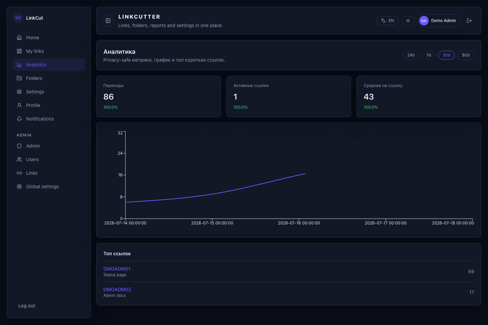 | 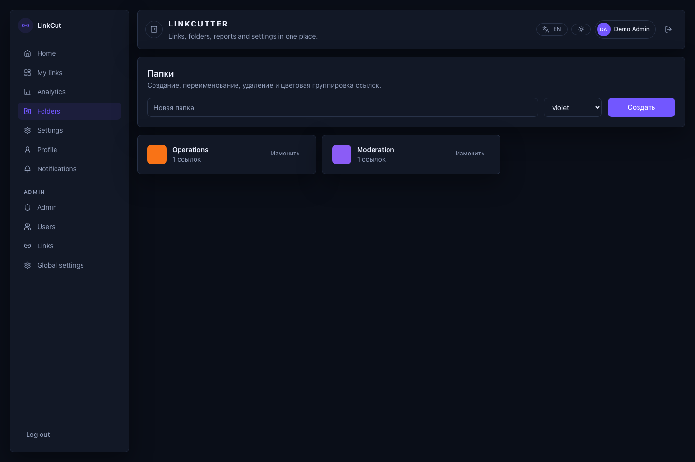 |

| Уведомления | Настройки | Профиль |
| --- | --- | --- |
| 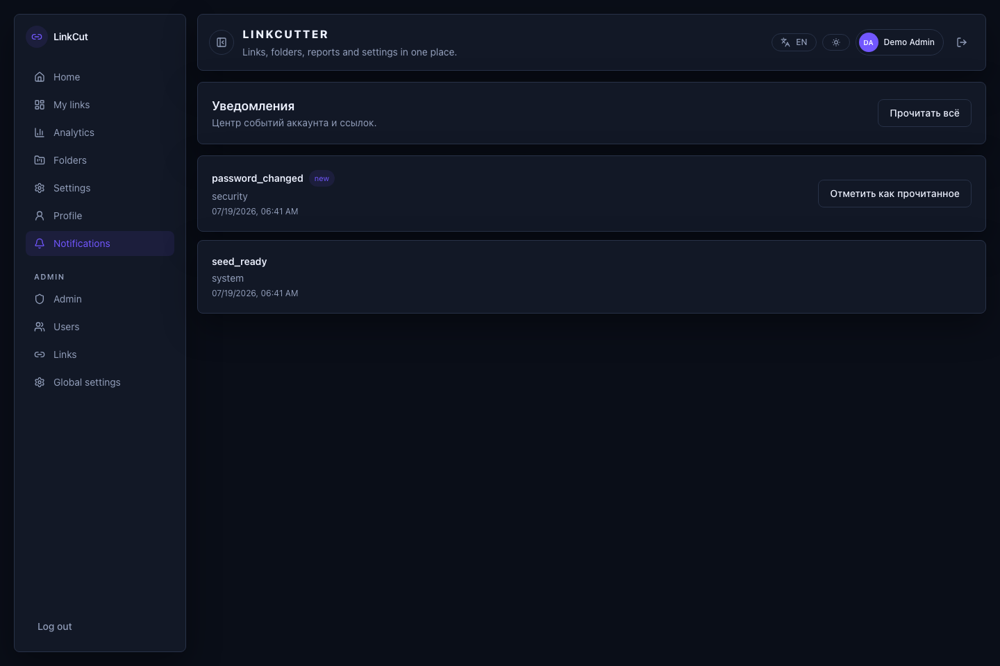 | 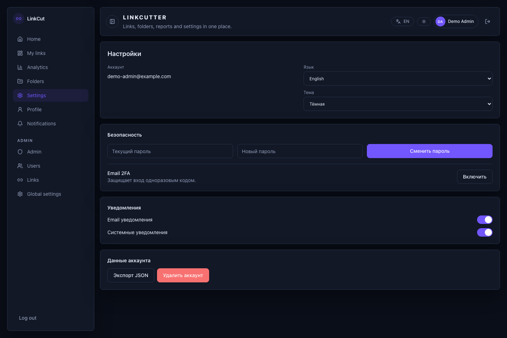 | 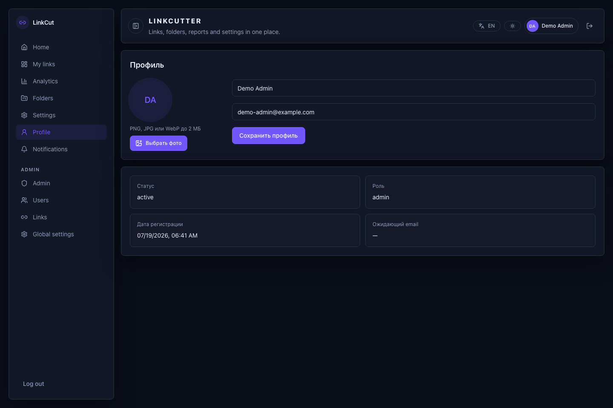 |

| Админ-панель | Пользователи | Ссылки | Глобальные настройки |
| --- | --- | --- | --- |
|  |  |  | 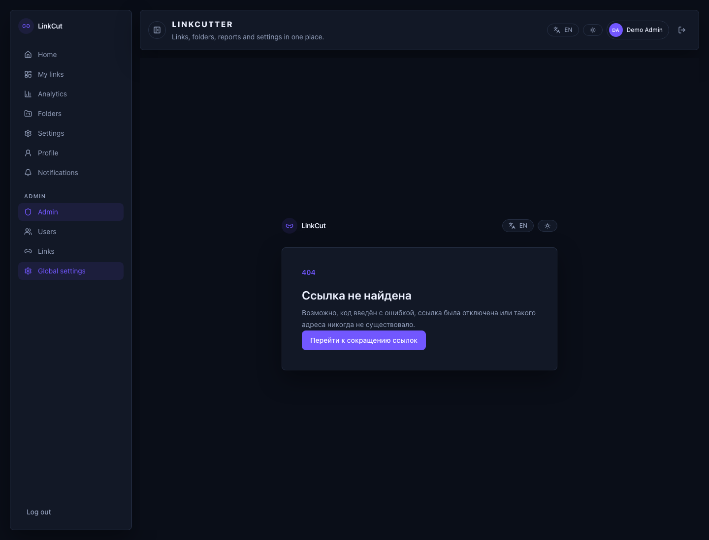 |

## Возможности

- Гостевое сокращение с нормализацией URL и повторным использованием уже созданной гостевой ссылки.
- Регистрация, подтверждение email, вход, обновляемая сессия, выход, сброс пароля и подготовленный сценарий email 2FA.
- Личные ссылки с папками, названием, включением и отключением. URL назначения и shortcode не редактируются.
- Агрегированная аналитика без IP, географии, устройства и referrer.
- Профиль, аватар, тема, язык, уведомления, экспорт данных и удаление аккаунта.
- Админские маршруты для модерации пользователей и ссылок, а также настройки срока работы ссылок удалённых аккаунтов.

## Быстрый старт

### Docker Compose

```bash
cp .env.example .env
docker compose up --build
```

После запуска:

- приложение: `http://127.0.0.1:3000`
- Swagger: `http://127.0.0.1:8000/docs`
- OpenAPI: `http://127.0.0.1:8000/openapi.json`

### Локальная разработка

Backend:

```bash
python3 -m venv .venv
source .venv/bin/activate
pip install -r requirements-dev.txt
cp .env.example .env
uvicorn main:app --app-dir src --reload
```

Frontend, во втором терминале:

```bash
cd frontend
npm ci
npm run dev
```

Vite работает на `http://127.0.0.1:3000` и проксирует `/api` и `/health` на backend по адресу `http://127.0.0.1:8000`.

### Демо-данные

Команда создаёт локальные проверенные аккаунты, папки, ссылки, уведомления и агрегированную статистику. В production она завершается ошибкой.

```bash
DEMO_SEED_PASSWORD='DemoPass123!' PYTHONPATH=src python -m app.demo_seed
```

Учётные записи: `demo-admin@example.com` и `demo-user@example.com`. Пароль - значение `DEMO_SEED_PASSWORD`.

## Проверка

```bash
PYTHONPATH=src ruff check .
PYTHONPATH=src pytest
cd frontend && npm run lint
cd frontend && npm test -- --run
cd frontend && npm run build
cd frontend && npm run test:e2e
```

GitHub Actions выполняет эти проверки для push и pull request.

## Границы pet-проекта

- SQLite и локальное хранилище аватаров оставлены намеренно.
- Redis ускоряет редиректы и rate limit, но локально есть fallback в памяти.
- В development токены email-подтверждения и сброса возвращаются API. Для production нужен почтовый провайдер.
- Публичный демо-сайт не заявлен.

## Документы

- [README на английском](./README.md)
- [История изменений](./CHANGELOG.md)
- [Правила участия](./CONTRIBUTING.md)
- [Политика безопасности](./SECURITY.md)

## Лицензия

[MIT](./LICENSE)
